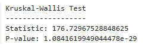
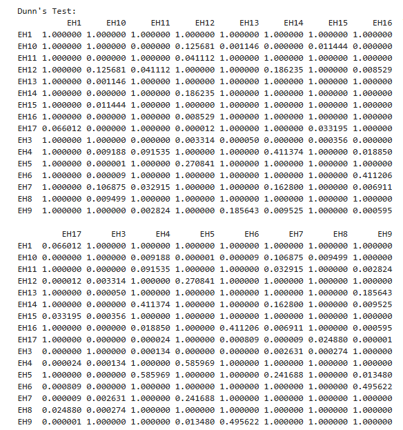

# **DSPP_May26_Summative**

---

## ***Data Science Project - Edinburgh House Prices***

The following shows the Data Science Project I did for the DPSS L4 Course. The initial scraped datasets along with post-processed dataset after pipeline transformations are included in this repository

---

### Executive Summary 

This project aims to explore whether different postal codes in Edinburgh has any effect on property prices in the city. Through data scraping of online resources, a dataset of residential property prices was obtained for the project.
Initial analysis - through summary statistics of the dataset used suggested - that prices did differ by area however, summary statistics on it’s own was not enough evidence for this. However, later on, through the use of a Kruskal Wallis non-parametric hypothesis test combined a post hoc Dunn test suggests that house prices do differ significantly in some postcode areas in the City of Edinburgh.

---

### Data Infrastructure & Tools 

Multiple tools were used during the duration of the project. As there was no public dataset already available that I could access for free to get information on property prices this meant I needed to utilise python to data scrape the information I needed for the project from the property website Rightmove of residential property prices in Edinburgh. 
I discovered a template Python script online written by Clarke (2024) which I used for the data scraping on Rightmove as is it performed the exact function that was required and was already tailored for the Rightmove website I was using. This data scrape leads on to the other tools I used of Excel and SQL Server Management Studio.   Excel was used to view the extracted dataset due to its familiarity and user friendly nature – including it’s simple features -  of reviewing data. 
Due to the nature of pipelining and data storage that SSMS provides with its ability to create and execute stored procedures and also manage security it made sense to use SSMS for the storage and transformations of the initial raw extracted dataset. More information on this will be provided in the next section – Data Engineering.
While Python was used for the initial extract, the functionality from imported packages like Pandas, Matplotlib, ‘scikit_posthocs’, and ‘scipy.stats’ allowed it to be used for both Data Visualisation and Analysis portions of this project as well. Pandas is widely used for data manipulation and Matplotlib is also widely used for the Data Visualisation through it’s ability to generate graphs and charts which is why it made sense to use for this project. The sci packages used also allowed for the statistical analysis that was required for this project.

---

### Data Engineering

---

### Data Analysis and Visualisations

Initial exploratory data analysis was performed on the exported dataset – to gain an initial high-level view of the transformed data itself. The initial exploratory analysis was done on Python using both the pandas package and matplotlib package to get both summary statistics of the dataset along with graphical visualisations of the distribution of data by different postcode areas respectively.

```python
summary = df.groupby("postcode_area")["normalised_price"].agg(["count", "mean", "median", "std", "min", "max"]) 

print(summary)
```


As can be seen above, it appears that both the mean and median of the normalised prices by postcode area differs to some extent between different postcode areas. While the summary statistics can’t be considered as definitive evidence on its own - it is however, a good initial indicator that prices may differ by postcode area. It should also be noted that a count was done on each postcode area to see how many data points we had for prices. It was then decided that any postcode areas that had less than 30 records of data was to be removed from the analysis. This was done to remove any anomalies and noise present in the data since the limited amount of records available for that postcode area might distort the analysis or give us an incorrect value for the summary statistics. While it was decided that 30 would be the threshold for whether or not a postcode area would be included in the analysis it should be noted that this was a completely arbitrary decision as 30 seemed instinctually a reasonable threshold value to use.
After reading a guide on Hypothesis Testing on the University of Sheffield’s website, it was noted that many different hypothesis tests exist. As more than 3 different groups existed in this dataset, this meant that using either an ANOVA or Kruskal Wallis hypothesis test would be the most appropriate for the analysis. To help decide which one was to be used I needed to view how the data was distributed by different postcodes. The figures below – generated from the matplotlib package - shows the distributions price in different postcode areas.


After looking at the visualisations of distributions for property prices in different postcodes it was seen generally that the data wasn’t normally distributed with most of the histograms skewed to the right. This meant that a non-parametric test would be more suitable to use as the hypothesis test (Allam, 2025). As the Kruskal Wallis test is a non-parametric test (Ostertagova, 2014) that doesn’t rely on normal distributions of data and is based on ranking rather than mean values of groups; the Kruskal Wallis test was used for the dataset.
With the hypothesis test settled on, the following null and alternative hypotheses were used:
H0 = There is no significant difference in the different postcode group medians
H1 = At least one postcode area group has a different median to the others.
Most commonly a significance level of 0.05 (Su, 2025) is used as the threshold to determine whether H0 is rejected or not. This will also be the case for this test and using the scipy.stats package the Kruskal Wallis test determined the following test statistics and p-value shown in script below:

```python
statistic, p_value = kruskal(*groups)

print("Kruskal-Wallis Test")
print("-------------------")
print("Statistic:", statistic)
print("P-value:", p_value)
```



As the P-value is lower than the significance level the null hypothesis is rejected and it can be said that the results are statistically significant enough to say that at least one postcode area group has a different median to the others. 
Because the null hypothesis was rejected a post-hoc Dunn test was also done to see which postcode areas showed a statistically significant difference in house price distributions. The script below show the Python code used for the test and the results of the test respectively.

```python
posthoc = sp.posthoc_dunn(
    df_test,
    val_col="normalised_price",
    group_col="postcode_area",
    p_adjust="bonferroni"
)

print("\nDunn's Test:")
print(posthoc)
```



As there was 132 comparisons a Bonferroni adjustment was applied to the Dunn test and in the array of results above the p-values in red show the postcode area pairs that show a statistically significant difference in house price distributions. This along with the summary statistics indicate the possibility that property prices differ significantly between some Edinburgh postcode areas.

### *Reference List*
Allam, I. (2025) ANALYSIS OF VARIANCE (ANOVA): A COMPREHENSIVE STUDY OF CONCEPT, APPLICATION, AND IMPORTANCE IN EXPERIMENTAL DATA ANALYSIS. Doi: 10.13140/RG.2.2.15506.72640  

Chugani, V. (2024) Hypothesis Testing Made Easy. Available at: https://www.datacamp.com/tutorial/hypothesis-testing (Accessed: 13 August 2026)

Clarke, S (2024) Scraping Rightmove Sales Data Using Python and cURL. Available at: https://medium.com/@sebastian.clarke224/scraping-rightmove-sales-data-using-python-and-curl-7e491e556f5a (Accessed: 12 August 2026)

Dinno, A (2015) ‘Nonparametric Pairwise Multiple Comparisons in Independent Groups Using Dunn’s Test’, The Stata Journal, 15(1), pp. 292-300. Doi: https://doi.org/10.1177/1536867X1501500117

Dunn, O. J. (1964). ‘Multiple Comparisons Using Rank Sums’, Technometrics, 6(3), pp. 241-252. Doi: https://doi.org/10.2307/1266041 

GeeksForGeeks (2026) Hypothesis Testing. Available at: https://www.geeksforgeeks.org/data-science/understanding-hypothesis-testing/ (Accessed: 13 August 2026)

Kenton, W. (2025) What Is Analysis of Variance (ANOVA)?. Available at: https://www.investopedia.com/terms/a/anova.asp (Accessed: 13 August 2026)

Kruskal, W. H., Wallis, W. A. (1952) ‘Use of Ranks in One-Criterion Variance Analysis’, Journal of the American Statistical Association, 47(260), pp. 583-621. Doi: https://doi.org/10.1080/01621459.1952.10483441 

Newcastle University (2026) Analysis of Variance (ANOVA). Available at: https://services.ncl.ac.uk/itservice/research/dataanalysis/advancedmodelling/analysisofvarianceanova/ (Accessed: 14 August 2026)

Ostertagova, E., Ostertag, O, and Kováč, J (2014). ‘Methodology and Application of the Kruskal-Wallis Test’, Applied Mechanics and Materials, 611, pp. 115-120. Doi: 10.4028/www.scientific.net/AMM.611.115

Rajesh, R (2023) A Post-hoc Test for Kruskal-Wallis. Available at: https://www.theanalysisfactor.com/dunns-test-post-hoc-test-after-kruskal-wallis/ (Accessed: 14 August 2026)

Rightmove (2026) House Prices in Edinburgh. Available at: https://www.rightmove.co.uk/house-prices/edinburgh.html (Accessed: 12 August 2026)

Statistics How To (2026). Available at: https://www.statisticshowto.com/dunns-test/ (Accessed: 14 August 2026).

Statistics Kingdom (2026) Kruskal Wallis Test Calculator. Available at: https://www.statskingdom.com/kruskal-wallis-calculator.html (Accessed: 14 August 2026)

Su, J (2025) ‘Application and Role of Hypothesis Testing in Practice, Theoretical and Natural Science, 106(1), pp. 10-14. Doi: https://doi.org/10.54254/2753-8818/2025.22575 

The SciPy community (2008) scipy.stats.kruskal. Available at: https://docs.scipy.org/doc/scipy/reference/generated/scipy.stats.kruskal.html?utm_source=chatgpt.com (Accessed: 14 August 2026)

Thevapalan, A. (2024) A Comprehensive Guide to Using ANOVA in Excel. Available at: https://www.datacamp.com/tutorial/excel-anova-guide (Accessed: 14 August 2026)

University of Sheffield (2026) Choosing a Hypothesis test. Available at: https://sheffield.ac.uk/mash/stats-resources/choosing (Accessed: 13 August 2026)

University of Sheffield (2026) Introduction to Hypothesis tests. Available at: https://sheffield.ac.uk/mash/stats-resources/hypothesis (Accessed: 13 August 2026)

W3Schools (2026) SQL Stored Procedures. Available at: https://www.w3schools.com/sql/sql_stored_procedures.asp (Accessed: 13 August 2026)
